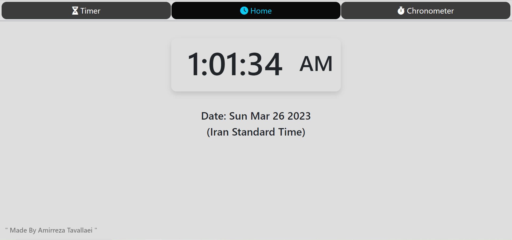
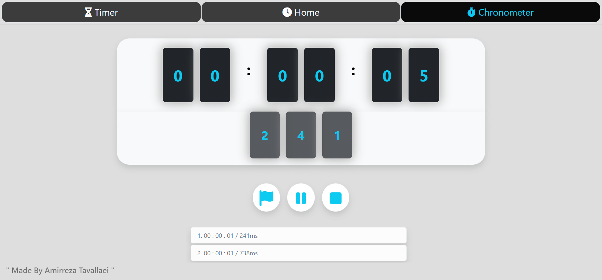
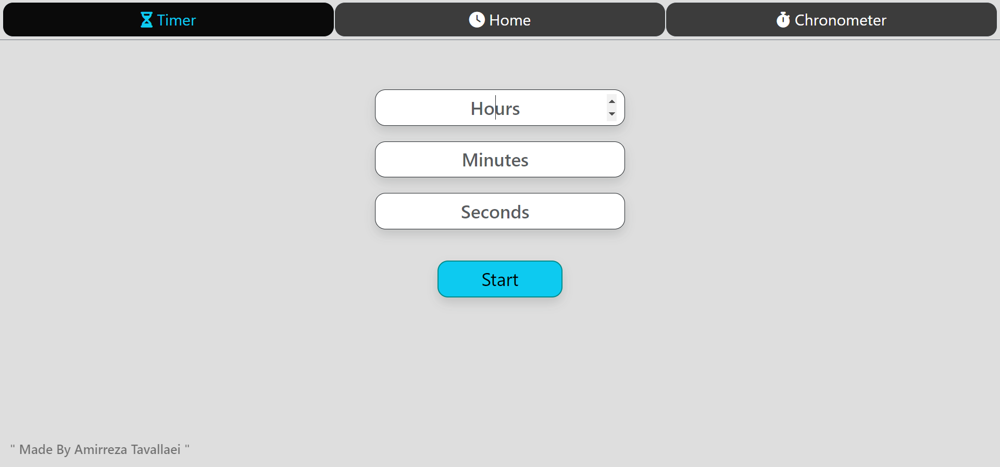

# Web-Time-Management

This is a FrontEnd project:

This project is a "time management" program on the web, made with Bootstrap and JavaScript and includes --> Clock, Timer, Chronometer.

It is fully responsive and displays well on all devices.

Here is two pictures of project:

# Picture 1

# Picture 2

# Picture 3

